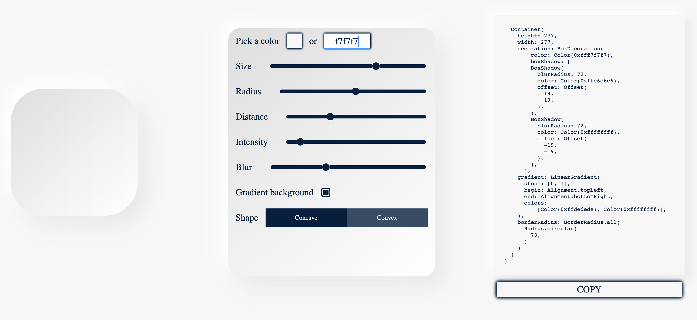

# Flutter Neumorphism

A flutter web application for Neumorphic UI Dart code generation.

## Link to the application
Check out the app at [https://flutterneumorphism.com](https://flutterneumorphism.com)

## Neumorphism

Neumorphism is a new word for the new user interface trend. Since this is a hard word to pronounce, some people also say Soft UI.

Let us start with the root of the word “Neumorphic”. It is a combination of 2 words. Neu and Morphic: Neu: New + Morphic: a variant of Morphous, meaning having a specific shape or form.  _This word was also used in an old interface design trend called Skeu_**_morphic._**

## Features

Neumorphic Flutter widgets code generator that will help with colors, gradients and shadows to adapt this new design trend or discover its posibilities.

#### Type the color hexcode(eg. 'ffffff') or use color picker to change the color of the Container.
#### Use the sliders to adjust:
- Size
- Radius
- Distance
- Intensity
- Blur
#### Use the buttons to toggle:
- Background Gradient
- Concave/Convex shape

#### Finally click **COPY** to copy the code to clipboard. 

## Inspiration

Adam Giebl's [https://neumorphism.io](https://neumorphism.io), which generates CSS code for neumorphic elements, was a great source of inspiration. A liitlle bit of exploration helped me understand the quick maths behind that. ;)

